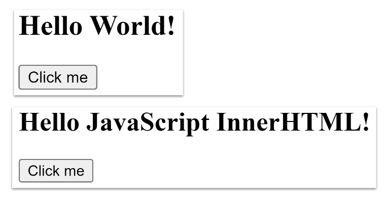

# web-js-dom-exercise-01

## Re-create your own “Hello World!” and “Click me” Button

- Create an index.html and script.js
- For CSS, create a style.css or use Tailwind CSS via CDN
- Breakdown your step-by-step DOM manipulation
- Explain your code line-by-line to your peers
- Challenge: Add more elements to display more messages

  
